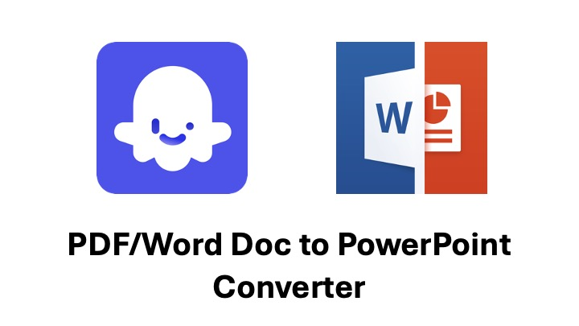

# PDF/Word Document to PowerPoint Converter

The objective of this project is to leverage the Coze AI platform to develop a specialized chatbot assistant. This chatbot will assist users in reading and processing PDF or Word documents, subsequently generating a presentation outline based on the content.

Using the generated presentation outline in conjunction with DALLE3 from Coze AI, the chatbot can produce images suitable for slide backgrounds, enhancing the visual appeal of the presentation.

It also allows users to customise the formatting of the slides such as font sizes and aspect ratios.

## Features and Tools

1. Plugin

I have designed two custom plugins using Python.

The first plugin is developed using `pypdf`, `python-docx` and `requests` packages. It is used to read a Word doc or PDF doc URL and extract all text information from the document. The extracted texts will then be fed into LLM to process the data.

The second plugin is developed using the `python-pptx` and `google-cloud-storage` packages. 
This plugin provides a straightforward and slight customisable PowerPoint creation and it will be uploaded to GCS for users to download. 

2. Workflow

To ensure seamless execution of the chatbot's functionalities, we have established multiple workflows. These workflows serve as structured guides for the chatbot, orchestrating the processes of document reading, content processing, formatting, and ultimately, slide creation in PowerPoint.

## Demo Video

Feel free to watch the demo video to see the chatbot in action!

This chatbot is not published in the Coze Bot store yet as the GPT-4 models are not very stable at the moment (frequent timeout).
